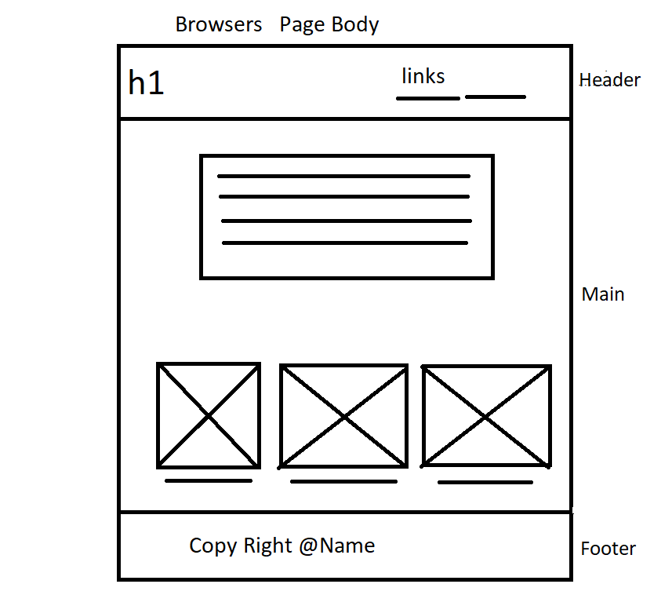

# browsers

## What is the Web browser
>  A **web browser**, often referred to simply as a browser, is application software for accessing the World Wide Web. When a user requests a web page from a particular website, the web browser retrieves the necessary content from a web server and then displays the page on the user's device. A web browser is not the same as a search engine, though the two are often confused.A search engine is a website that provides links to other websites. However, to connect to a website's server and display its web pages, a user must have a web browser installed.

## The Wireframe
